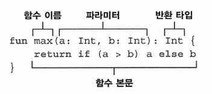
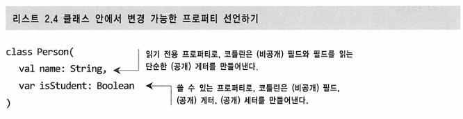
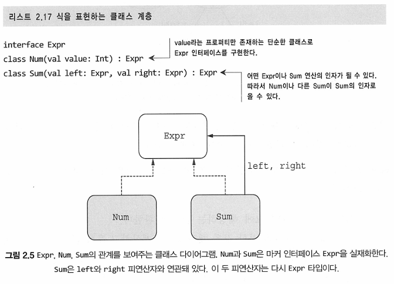
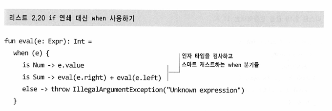

# 2장. 코틀린 기초

---
## 2.1 기본 요소: 함수와 변수
 - 함수를 선언할 때 fun 키워드를 사용한다. 
 - 함수를 모든 코틀린 파일의 최상위 수준에 정의할 수 있다. 따라서  클래스 안에 함수를 넣어야 할 필요가 없다.
 - 최상위에 있는 main() 함수를 애플리케이션의 진입점으로 지정할 수 있다. 
 - 코틀린은 간결성을 강조한다. println만 써도 된다..(자바 저격 그만)

### 2.1.2 파라미터와 반환값이 있는 함수 선언
```kotlin
fun max(a: Int, b: Int): Int{
    return if (a > b) a else b
}
```
- 함수 이름 뒤에는 괄호 안에 파라미터 목록이 온다. 여기서 두 파라미터의 타입이 Int임을 확인할 수 있다.
- 코틀린에서 if는 결과를 만드는 식이라는 점에 유의한다. if가 두가지 모두에서 값을 반환한다고 생각할 수 있다. 이는 자바의 삼항 연산자와 비슷하다.



main 함수는 모든 코틀린 프로그램의 진입점이다. 이 함수는 차라미터가 없는 함수로 선언될 수도, 문자열 배열이 파라미터인 함수로 선언될 수도 있다. 후자의 경우 배열의 각 원소는 애플리케이션에게 전달된 각각의 인자에 대응한다.
어떤 경우든 main 함수는 아무것도 반환하지 않는다.

코틀린에서 if는 식이지 문이 아니다. **식**은 값을 만들어내며 다른 식의 하위ㅣ 요소로 계산에 참여할 수 있는 반면, **문**은 자신을 둘러싸고 있는 가장 안쪽 블록의 최상위 요소로 존재하며 아무런 값을 만들어내진 않는다는 차이가 있다.

### 2.1.3 식 본문을 사용해 함수를 더 간결하게 정의 
위의 max 함수를 더 간결하게 표현할 수도 있다. max 함수 본문이 if 식 하나만 이뤄져 있기에 이 식을 함수 본문 전체로 하고 중괄호를 없앤 후 return을 제거할 수 있다.
대신에 유일한 식을 등호 뒤에 위치시켜야 한다.

```kotlin
fun max(a: Int, b: Int) : Int = if(a > b) a else b
```

본문이 중괄호로 둘러싸인 함수를 블록 본문 함수라고 하고, 등호와 식으로 이뤄진 함수를 식 본문 함수라 부른다.

코틀린에서는 식 본문 함수가 자주 쓰인다. 조건 검사나 자주 사용되는 연산에 기억하기 쉬운 이름을 부여하는 뻔한 함수의 경우에도 식 본문 함수가 꽤 편리하다.
물론 if, when, try 등의 더 복잡한 식을 평가하는 함수에도 식 본문 함수가 유용하다.

또한 함수에서 반환 타입을 생략할 수 있다. 코틀린은 이러한 기능을 **타입 추론**을 통해 제공한다. 다만 이는 **식 본문 함수**의 반환 타입에만 생략 가능하다는 점에 유의한다. 값을 반환하는 블록 본문 함수의 경우에는 반드시 반환 타입을 지정하고 return 문을 통해 반환값을 명시해야 한다.

### 2.1.4 데이터를 저장하기 위해 변수 선언
코틀린은 여러 변수 선언에서 타입 지정을 생략할 수 있게 해준다. 

식 본문 함수와 마찬가지로 타입을 지정하지 않으면 컴파일러가 초기화 식을 분석해서 초기화 식의 타입을 변수 타입으로 지정한다.

### 2.1.5 읽기 전용 변수나 재대입 가능 변수
- val은 읽기 전용 참조를 선언한다. val로 선언된 변수는 단 한 번만 대입될 수 있다.
- var는 재대입 가능한 참조를 선언한다. 이러한 변수는 다른 값을 대입할 수도 있다.

기본적으로 코틀린에서는 val 키워드를 사용해 선언하는 방식을 지켜야 한다. 필요할 때에만 var를 사용하자.

다만 var 키워드를 사용하면 변수의 값은 변경할 수 있지만 변수의 타입은 고정된다. 프로그램 중간에 정수형으로 선언된 변수를 중간에 문자열을 저장하면 컴파일 오류를 만나게 된다.

## 2.2 행동과 데이터 캡슐화: 클래스와 프로퍼티
코틀린은 자바의 클래스에 필요한 긴 코드가 필요하지 않다. 생성자 본문은 특히 반복적이다. 파라미터 이름과 동일한 필드에 값을 대입하는 코드이기 때문이다.
또한 게터나 세터를 위한 추가 코드또한 필요한데 코틀린은 이를 매우 적은 양의 코드로 이를 지원한다.

```kotlin
class Person(val name: String)
```

코틀린의 기본 가시성은 public이므로 지정자를 생략해도 된다.

### 2.2.1 클래스와 데이터를 연관시키고, 접근 가능하게 만들기: 프로퍼티
자바에서는 필드와 접근자(게터, 세터)를 한데 묶어 프로퍼티라고 부르며 이를 활용하는 프레임워크가 많다. 코틀린은 프로퍼티를 언어 기본 기능으로 제공하며 코틀린 프로퍼티는 자바의 필드와 접근자 메서드를 완전히 대신한다.


기본적으로 코틀린에서 프로퍼티를 선언하는 방식은 프로퍼티와 관련 있는 접근자를 선언하는 것이다. 

어차피 해도 변경 불가한 val이니까, 그냥 프로퍼티 값 그대로 접근 가능하구나 이해할 수 있다.

### 2.2.2 프로퍼티 값을 저장하지 않고 계산: 커스텀 접근자

프로퍼티 접근자를 커스텀 구현할 수 있는데, 이는 주로 어떤 프로퍼티가 같은 객체 안의 다른 프로퍼티에서 계산된 직접적인 결과인 경우다.

```kotlin
class Rectangle(val height: Int, val width: Int) {
    val isSquare: Boolean
        get() {
            return height == width
        }
}

fun main(){
    val rectangle: Rectangle(41, 43);
    println(rectangle.isSquare) //false
}
```
커스텀 게터를 정의하는 방식과 클래스 안에 파라미터가 없는 함수를 정의하는 방식은 성능상 차이가 없기에 가독성을 고려해서 채택하면 될 것이다.

- 클래스의 특성을 기술하고 싶다면 => 프로퍼티를 선택
- 클래스의 행동을 기술하고 싶다면 => 멤버 함수를 선택


## 2.3 선택 표현과 처리: enum과 when
### 2.3.1 이넘 클래스와 이넘 상수 정의
```kotlin
enum class Color{
    RED, ORANGE, YELLOW ...
}
```
enum은 소프트 키워드이다. 이는 class 앞에 있을 때는 특별한 의미를 지니지만 다른 곳에서는 일반적인 이름으로 사용할 수 있다.
반면에 class는 하드 키워드이기에 식별자로 사용할 수 없다.

색상 값을 빨,노,파라는 컴포넌트로 표현하는 경우가 자주 있다. 이넘 상수 역시 앞에서 봤던 일반적인 클래스와 마찬가지로 생성자와 프로퍼티 선언 문법을 사용할 수 있다.

Color.kt 참고...

이 예제에서는 코틀린에서 유일하게 세미콜론이 필수인 부분을 볼 수 있다. 이넘 클래스 안에서 메서드를 정의하는 경우 반드시 이넘 상수 목록과 메서드 정의 사이에 세미콜론을 넣어야 한다.

### 2.3.2 when으로 이넘 클래스 다루기
자바의 switch 문, 자바 13부터 switch 식으로 무지개의 각 색에 대해 그와 상응하는 연상 단어를 짝지어주는 함수를 만들 수 있다. 
코틀린도 이에 대응되는 when을 지원한다. 

if와 마찬가지로 when도 값을 만들어내는 식이다. 따라서 식 본문 함수에 when을 바로 사용해서 when 식을 바로 반환할 수 있다.

### 2.3.6 스마트 캐스트: 타입 검사와 타입 캐스트 조합


식을 인코딩할 때 트리와 같은 구조로 저장한다.



when을 극한으로 사용하면 if를 사용하지 않아도 이렇게 간단하게 표현할 수 있다..