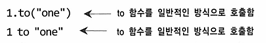
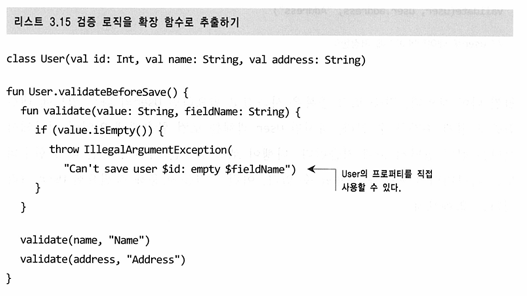

# 3장 함수 정의와 호출
## 3.1 코틀린에서 컬렉션 만들기 
```Kotlin
val set = setOf(1, 7, 53)
val list = listOf(1, 7, 53)
val map = mapOf(1 to "one", 7 to "seven", 53 to "fifty-three")
```
코틀린은 표준 자바 컬렉션 클래스를 사용한다. 코틀린은 자바 컬렉션에 대한 지식을 활용할 수 있다. 
하지만 **자바와 달리 코틀린 컬렉션 인터페이스는 읽기 전용이다.**

## 3.2 함수를 호출하기 쉽게 만들기
toString()이 이미 디폴트로 들어가 있어서 println()으로 컬렉션을 바로 출력할 수 있다.
 
오버로딩을 Java 보다 간편하게 만들어준다. 

## 3.3 메서드를 다른 클래스에 추가: 확장 함수와 확장 프로퍼티
기존 자바 API를 재작성하지 않고도 편리한 여러 기능을 사용할 수 있도록 코틀린은 **확장 함수**가 있다.
이는 어떤 클래스의 멤버 메서드인 것처럼 호출할 수 있지만 그 클래스의 밖에 선언된 함수다. 
추가 함수 이름 앞에 그 함수가 확장할 클래스의 이름을 덧붙이는데 이런 클래스를 **수신 객체 타입**이라고 부른다.

확장함수는 정적 메서드와 같은 특성을 가지므로 오버라이딩할 수 없다.

## 3.4 컬렉션 처리: 가변 길이 인자, 중위 함수 호출, 라이브러리 지원
- vararg 키워드를 사용하면 호출 시 인자 개수가 달라질 수 있는 함수를 정의할 수 있다.
- 중위 함수 호출 구문을 사용하면 인자가 하나뿐인 메서드를 간편하게 호출할 수 있다.
- 구조 분해 선언을 사용하면 복합적인 값을 분해해서 여러 변수에 나눠 담을 수 있다.

listOf()같은 함수를 호출할 때에 원하는 만큼 많이 원소를 전달할 수 있다. 이때 가변 길이 인자(varargs)를 사용한다. 
파라미터 앞에 vararg 변경자를 붙이면 된다.

```kotlin
val map = mapOf(1 to "one", 7 to "seven", 53 to "fifty-three")
```
이 코드에서 to 코틀린의 키워드가 아니라, 중위 호출이라는 특별한 방식으로 to라는 일반 메서드를 호출한 것이다.


이자가 하나뿐인 일반 메서드나 인자가 하나뿐인 확장 함수에만 중위 호출을 사용할 수 있다. 
함수를 중위 호출에 사용하게 허용하고 싶다면 infix 변경자를 함수 선언 앞에 추가해야 한다.

```kotlin
infix fun Any.to(other: Any) = pair(this, other)
```

이런 기능을 **구조 분해 선언**이라고 부른다.

## 3.6 코드 깔끔하게 다듬기: 로컬 함수와 확장
코틀린에서는 함수에서 추출한 함수를 원래의 함수 내부에 내포시킬 수 있다. 이를 통해 문법적인 부가 비용을 들이지 않고도 깔끔하게 코드를 조직할 수 있다.

중복되는 메소드가 보이는 예제(3.12)의 검증 로직을 확장 함수로 추출하여 많이 단축시킬 수 있다.

